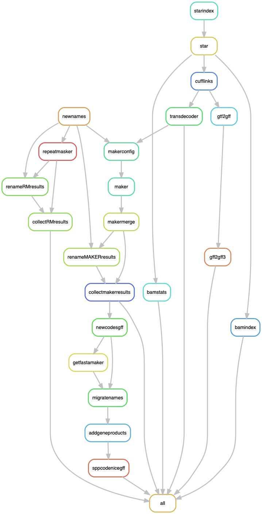

# PaAnnotation: A pipeline to annotate *Podospora* genomes

I designed this pipeline to run in [Uppmax](https://uppmax.uu.se/), but if one installs MAKER and dependencies locally, it should be possible to run it locally too.

## The data
The genome assemblies must be already in the path `data/genomes/` with a format such as `data/genomes/strain.fa`, where strain stands for the strain code as in the configuration file.

The reference genome of *P. anserina* (strain S), must also be there. I was originally published by [Espagne et al. (2008)](https://www.ncbi.nlm.nih.gov/pmc/articles/PMC2441463/), and improved in the Joint Genome Institute MycoCosm [website](https://genome.jgi.doe.gov/programs/fungi/index.jsf) under the name Podan2. There is a Podan3, but as far as I can tell is the same assembly. It's available also at [https://github.com/johannessonlab/SpokPaper/blob/master/Fig4_S3_Backcrosses/extras/Podan2_AssemblyScaffoldsmt.fa](https://github.com/johannessonlab/SpokPaper/blob/master/Fig4_S3_Backcrosses/extras/Podan2_AssemblyScaffoldsmt.fa). For this pipeline it must be present in `data/genomes/Podan2.fa`

Likewise, the RNAseq data sets must be in the path `data/rnaseq/rnasample_postQC.1.fq.gz`, where `rnasample` matches the code in the configuration file.

The reference genome of P. comata is that of the strain T (also known as TD in [Vogan et al. 2019](https://elifesciences.org/articles/46454)) was published by [Silar et al. 2018](https://link.springer.com/article/10.1007/s00438-018-1497-3). It's deposited in the European Nucleotide Archive, [GCA_900290415.1](https://www.ebi.ac.uk/ena/data/view/GCA_900290415.1). Unfortunately the names are very ugly, so I modified them to be more like `Chromosome_1`, like such:

    $ cat GCA_900290415.1_version1_genomic.fna | sed 's;\(>[A-Z0-9\.]*\)\s\([a-zA-Z ,]*\): ;>Chromosome_;' > PODCO.fa
    $ sed -i 's;Chromosome_mitochondrion;Mitochondrion;' PODCO.fa

And for the gff file (less elegantly):

    $ sed -i 's/LR026964.1/Chromosome_1/' PODCO.gff3
    $ sed -i 's/LR026965.1/Chromosome_2/' PODCO.gff3
    $ sed -i 's/LR026966.1/Chromosome_3/' PODCO.gff3
    $ sed -i 's/LR026967.1/Chromosome_4/' PODCO.gff3
    $ sed -i 's/LR026968.1/Chromosome_5/' PODCO.gff3
    $ sed -i 's/LR026969.1/Chromosome_6/' PODCO.gff3
    $ sed -i 's/LR026970.1/Chromosome_7/' PODCO.gff3
    $ sed -i 's/LR026971.1/Mitochondrion/' PODCO.gff3

I provided the protein and CDS sequences from Podan2 as `data/Podan2/Podan2_AssemblyScaffoldsmtGenesEd_aa.fas`.

As external evidence, there are three files at `data/OtherSpp`

* curated_aa.fas --> Manually curated proteins
* Pcomata_aa.fas --> Modified from GCA_900290415.1

I also provide in this repository the training files I made in [Vogan et al. 2019](https://elifesciences.org/articles/46454)):

* For SNAP: `hmms/PaWa28m_PacBioChrPilon.hmm`
* For GeneMark: `hmms/gmhmm.mod` 

The GeneMark is very old, so I'm sure it can be improved.

## Extra Scripts

I wrote a few scripts for certain tasks, mostly to manipulate the gff3 files, and to rename the gene models to resemble the codes of Podan2. I used a brute force strategy with BLAST and occasional check of the flanking genes (assuming conserved synteny). It's not perfect at all, but it got the job mostly done.

    $ ls scripts/
    GFFnumerator.py    GffgenesIDFix.py   gff3addproduct.py   gffread2EVM.py     gffutils2fasta.py  runTransDecoder.sh

## Building the environment

First, I can start by updating conda.

    $ conda update -n base conda

Now, to create the environment.

    $ conda create -n Annotation

**IMPORTANT!!** activate the environment before installing stuff! or:

    $ conda install -c bioconda snakemake-minimal=5.7.4 python=3.6 -n Annotation

Notice the python version.

    $ conda activate Annotation
    $ conda install -c bioconda biopython=1.72
    $ conda install -c bioconda repeatmasker=4.0.7=pl5.22.0_11
    $ conda install -c bioconda star=2.6.1b
    $ conda install -c bioconda samtools=1.9
    $ conda install -c bioconda cufflinks=2.2.1=py36_2
    $ conda install -c bioconda transdecoder=5.5.0=0
    $ conda install -c bioconda igvtools=2.3.93=0
    $ conda install -c bioconda gffutils=0.9=py_1 

TransDecoder calls R scripts at some point, so I need some R packages:
    
    $ conda install -c r r-base=3.5.1=h1e0a451_2
    $ conda install -c conda-forge r-ggplot2=3.1.0=r351h6115d3f_1000 
    $ conda install -c bioconda bioconductor-seqlogo=1.48.0

Genemark is nowhere to be seen in Conda, unfortunately. So I had to relay on Uppmax for this one.

    $ module load bioinfo-tools maker/3.01.2-beta

This activates the following modules:

    $ module list

    Currently Loaded Modules:
      1) uppmax          4) bioinfo-tools                   7) blast/2.6.0+     10) augustus/3.2.3_Perl5.24.1  13) perl_modules/5.24.1
      2) gcc/6.3.0       5) BioPerl/1.7.1_Perl5.24.1        8) snap/2013-11-29  11) tRNAscan-SE/1.3.1          14) GeneMark/4.33-es_Perl5.24.1
      3) sqlite/3.16.2   6) RepeatMasker/4.0.7_Perl5.24.1   9) exonerate/2.2.0  12) perl/5.24.1                15) maker/3.01.2-beta

## Run pipeline in Uppmax

First, to get an idea of how the pipeline looks like we can make a rulegraph:

    $ snakemake --snakefile PaAnnotation.smk --configfile PaAnnotation_config.yml --rulegraph | dot -Tpng > rulegraph.png

To test that everything seems in order:

    $ snakemake --snakefile PaAnnotation.smk --configfile PaAnnotation_config.yml -pn

Run the pipeline in Uppmax (or a slurm cluster):

    $ screen -R PaAnnotation
    $ conda activate Annotation
    $ module load bioinfo-tools maker/3.01.2-beta
    $ snakemake --snakefile PaAnnotation.smk --configfile PaAnnotation_config.yml -p --cluster "sbatch -A snic20XX-X-XXX -p core -n {params.threads} -t {params.time} --mail-user xxxxxxx@xxxxx.xxx --mail-type=ALL" -j 25 --keep-going --use-conda &> PaAnnotation.log &
    [1] 2249

## Sources of information

- http://weatherby.genetics.utah.edu/MAKER/wiki/index.php/MAKER_Tutorial_for_GMOD_Online_Training_2014#MAKER.27s_Output
- https://isugenomics.github.io/bioinformatics-workbook/dataAnalysis/GenomeAnnotation/Intro_To_Maker.html
- http://weatherby.genetics.utah.edu/MAKER/wiki/index.php/The_MAKER_control_files_explained
- https://www.ebi.ac.uk/about/vertebrate-genomics/software/exonerate-user-guide
