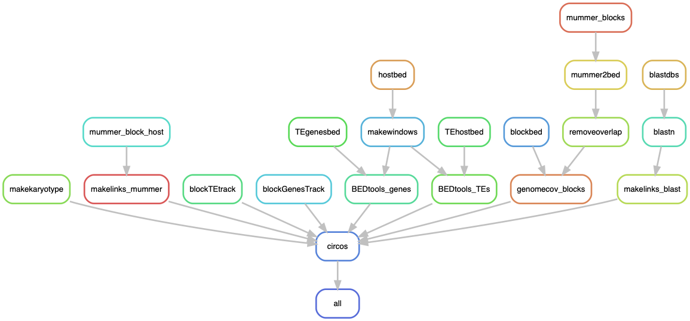

# Circos plot of the *Spok* block vs the host genome

A pipeline to produce Circos plots with the alignment of a Spok block to a full genome of a *Podospora* strain. In the paper we use the strain PaWa137m, which has the biggest block, for the main figure. We map its own block to itself, but the pipeline could in principle map any block to any strain.

I took the final ("nice") assemblies and then extracted the contigs that correspond to chromosomes. I also tried to order them following the *P. anserina* order. 

## Building the environment

I ran the pipeline under a [Conda](https://docs.anaconda.com/) environment. Install it first. If you like, you can start by updating it.

    $ conda update -n base conda

To create the environment arbitrarily named `CircosBlock`:

    $ conda create -n CircosBlock -c bioconda snakemake-minimal=5.8.1

To install software, activate the environment.

    $ conda activate CircosBlock

Now install:

    $ conda install -c bioconda circos=0.69.6=1
    $ conda install -c bioconda perl-app-cpanminus=1.7044
    $ conda install -c bioconda blast=2.9.0  
    $ conda install -c bioconda mummer4=4.0.0beta2 
    $ conda install -c bioconda samtools=1.9 
    $ conda install -c bioconda bedtools=2.29.0

Some Perl packages are necessary for Circos:

    $ cpanm Clone Config::General Font::TTF::Font GD GD::Polyline Math::Bezier Math::Round Math::VecStat Params::Validate Readonly Regexp::Common SVG Set::IntSpan Statistics::Basic Text::Format

## The configuration file

The configuration file contains the paths to the necessary files to run the pipeline.
        
    $ cat CircosBlock_config.yaml
```yaml
### Circos plot of the Spok block vs the host genome: *P. anserina* PaWa137m
### ----------------------------------
# The Circos configuration files must be in a folder called "circos" in the
# working directory

# Fasta files
block: "data/PaWa137m_SpokBlock.fa" # The focal block (from TSD to TSD)
host: "data/PaWa137m_chrs.fa" # Chosen strain, without mitochondrial scaffold!
otherblocks: "data/OtherBlocks.fa" # a fasta file with the sequence of other representative blocks to define the conserved bits (from TSD to TSD)

# Annotations
blockgff: "data/PaWa137m.nice.SpokBlock_Slice_5790592_6038100.gff" # In coordinates of the block, not of the host genome
# With coordinates adjusted to match the block alone (not the position in the original assembly).
# I did this like:
# $ python GFFSlicer.py data/PaWa137m.nice.SpokBlock.gff 5790592 6038100
# https://github.com/SLAment/Genomics/blob/master/GenomeAnnotation/GFFSlicer.py
# Notice that the coordinates are base 1

hostTEs: "/home/lore/data/FinalAssemblies/PaWa137m.repeatmasker.gff" # RepeatMasker annotation of the host genome
hostgenes: "/home/lore/data/FinalAssemblies/PaWa137m.nice-2.00.gff3" # Gene annotation of the host genome
```

## The Circos file

In the repo I'm including a folder called `circos` which in turn has a `etc` folder with all the configuration files. The script produces its own karyotype file from the input fasta files in the configuration file above.

## Run pipeline locally

Get into the folder with this repo's content, for example:

    $ cd /home/lore/SpokBlockPaper/1_CircosBlock/
    $ conda activate CircosBlock

First, to get an idea of how the pipeline looks like we can make a rulegraph:

    $ snakemake --snakefile CircosBlock.smk --configfile CircosBlock_config.yaml --rulegraph | dot -Tpng > rulegraph.png



For testing:

    $ snakemake --snakefile CircosBlock.smk --configfile CircosBlock_config.yaml -pn

Now you can run the pipeline. I like to make screen first, then activate the environment, and finally run the pipeline in the background.

    $ screen -R CircosBlock
    # Important to activate environment!!
    $ conda activate CircosBlock
    $ snakemake --snakefile CircosBlock.smk --configfile CircosBlock_config.yaml -p -j 10 --keep-going &> CircosBlock.log &

Notice `-j` stands for the number of threads that you want to give to your pipeline. See [Snakemake](https://snakemake.readthedocs.io/en/stable/) documentation for more information.

The results are `png` and `svg` files for the full synteny case (main figure) and for the inversions alone (supplementary) in the `circos` folder. I used the `png` file to make the main figure because it keeps the transparency values.
