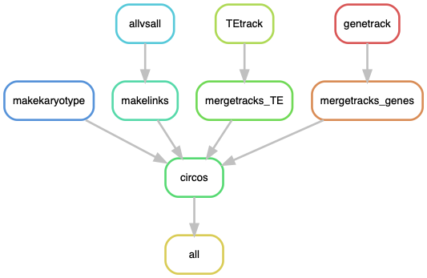

# Circos plot of the *Spok* blocks

A pipeline to produce Circos plots with the alignments of all Spok block types, including the block in PcWa139m (*P. comata*). The objective is to highlight the conserved bits between the block in PcWa139m and the *P. anserina* blocks.

## Building the environment

I ran the pipeline under a [Conda](https://docs.anaconda.com/) environment. Install it first. If you like, you can start by updating it.

    $ conda update -n base conda

To create the environment arbitrarily named `CircosBlock` (same one used in the pipeline `CircosAllBlocks.smk`):

    $ conda create -n CircosBlock -c bioconda snakemake-minimal=5.8.1

To install software, activate the environment.

    $ conda activate CircosBlock

Now install:

    $ conda install -c bioconda circos=0.69.6=1
    $ conda install -c bioconda perl-app-cpanminus=1.7044
    $ conda install -c bioconda blast=2.9.0  
    $ conda install -c bioconda mummer4=4.0.0beta2 
    $ conda install -c bioconda samtools=1.9 
    $ conda install -c bioconda bedtools=2.29.0

Some Perl packages are necessary for Circos:

    $ cpanm Clone Config::General Font::TTF::Font GD GD::Polyline Math::Bezier Math::Round Math::VecStat Params::Validate Readonly Regexp::Common SVG Set::IntSpan Statistics::Basic Text::Format

## The configuration file

The configuration file only contains the path to host genome (PaWa63p) exludig the mitochondrion, and the Spok block of PaWa137m. 
        
    $ cat Circos_config.yaml
```yaml
### Circos plot of the Spok blocks
### ----------------------------------
# The Circos configuration files must be in a folder called "circos" in the
# working directory

# A fasta file with all main types of Spok block (representative Psks) from TSD to TSD
allblocks: "data/MainBlocks.fa"

# Samples with gene and TE annotation
samples: ["PcWa139m"]
gffs: ["data/PcWa139m.nice.spokblock_Slice_328940_367471.gff"] # Both genes and TEs
```

## The Circos file

In the repo I'm including a folder called `circos` which in turn has a `etc` folder with all the configuration files. The script produces its own karyotype file from the input fasta files in the configuration file above.

## Run pipeline locally

Get into the folder with this repo's content, for example:

    $ cd /home/lore/SpokBlockPaper/CircosJustBlocks/
    $ conda activate CircosBlock

First, to get an idea of how the pipeline looks like we can make a rulegraph:

    $ snakemake --snakefile CircosAllBlocks.smk --configfile CircosAllBlocks_config.yaml --rulegraph | dot -Tpng > rulegraph.png



For testing:

    $ snakemake --snakefile CircosAllBlocks.smk --configfile CircosAllBlocks_config.yaml -pn

Now you can run the pipeline. I like to make screen first, then activate the environment, and finally run the pipeline in the background.

    $ screen -R CircosBlock
    # Important to activate environment!!
    $ conda activate CircosBlock
    $ snakemake --snakefile CircosAllBlocks.smk --configfile CircosAllBlocks_config.yaml -p -j 10 --keep-going &> CircosAllBlocks.log &

Notice `-j` stands for the number of threads that you want to give to your pipeline. See [Snakemake](https://snakemake.readthedocs.io/en/stable/) documentation for more information.

The results are `png` and `svg` files for the full synteny case (main figure) and for the inversions alone (supplementary) in the `circos` folder. I used the `png` file to make the main figure because it keeps the transparency values, while I used the `svg` for the supplementary in order to see the very thin lines.
