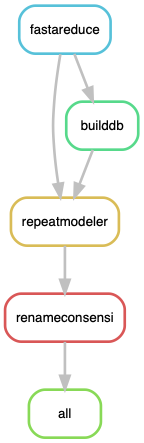

# Getting a nice library of repeated elements for *Podospora* species

The genomes to be annotated must be in a folder `data/genomes/`. So from the working path, a given sample looks like `data/genomes/{sample}.fa`, where `sample` comes from the configuration file.

It also needs a folder `scripts` with the script `renameRMDLconsensi.pl`.

So the necessary files are (that can be modified in the configuration file):

    data:
    genomes/

    scripts:
    renameRMDLconsensi.pl

## Preparing the environment
I had a lot of trouble trying to use RepeatModeler from conda. I even had issues with it in Uppmax (the server in Uppsala University) for the version 1.0.11. For example, if I do:

    $ module load bioinfo-tools RepeatModeler/1.0.11
    $ BuildDatabase -name RepeatModeler/PaYm/PaYm -engine ncbi data/reduced/PaYm_50kp.fa
    Building database RepeatModeler/PaYm/PaYm:
      Adding data/reduced/PaYm_50kp.fa to database
    Number of sequences (bp) added to database: 0 ( 0 bp )

So the library is empty...

Hence, I resorted to keep using the modules from Uppmax for some things. Otherwise, I prepared a conda environment.

### Uppmax modules

    $ module load bioinfo-tools
    $ module load RepeatModeler/1.0.8_RM4.0.7

### Conda

First, one can start by updating conda.

    $ conda update -n base conda

Now, to create the environment.

    $ conda create -n Annotation
    $ conda activate Annotation

    $ conda install -c bioconda snakemake=5.3.0
    $ conda install -c bioconda biopython=1.72
    $ conda install -c bioconda repeatmasker=4.0.7
    $ conda install -c bioconda biopython=1.72

## The configuration

You'll need a yaml file with the following structure:

```yaml
samplesID: ["Podan2", "CBS237.71m", "PaTgp", "PaWa137m", "PaYp", "PcWa139m", "PaWa100p", "PaWa21m", "PaWa28m", "PaWa46p", "PaWa53m", "PaWa58m", "PaWa63p", "PaWa87p"]

## Scripts
renamer: "scripts/renameRMDLconsensi.pl"

# Minimum size of a contig to get annotated
MINSIZE: 50000 

```

## Run the pipeline

First, to get an idea of how the pipeline looks like we can make a rulegraph:

    $ snakemake --snakefile PaTEs.smk --configfile PaTEs_config.yml --rulegraph | dot -Tpng > rulegraph.png



Run the pipeline:

    $ screen -R PaTEs
   
**Important to activate environment!!**

    $ conda activate Annotation

**And the Uppmax modules!!** or otherwise have a local installation of RepeatModeler.

    $ module load bioinfo-tools RepeatModeler/1.0.8_RM4.0.7

The key here is that I can only run one job at a time, so there is only one RM_* folder at any given time. Annoying, I know.

    $ snakemake --snakefile PaTEs.smk --configfile PaTEs_config.yml -p --cluster "sbatch -A PROJECTID -p core -n {params.threads} -t {params.time} --mail-user your@email.com --mail-type=ALL" -j 1 --keep-going &> PaTEs.log &

