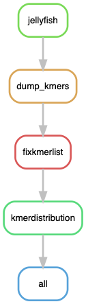
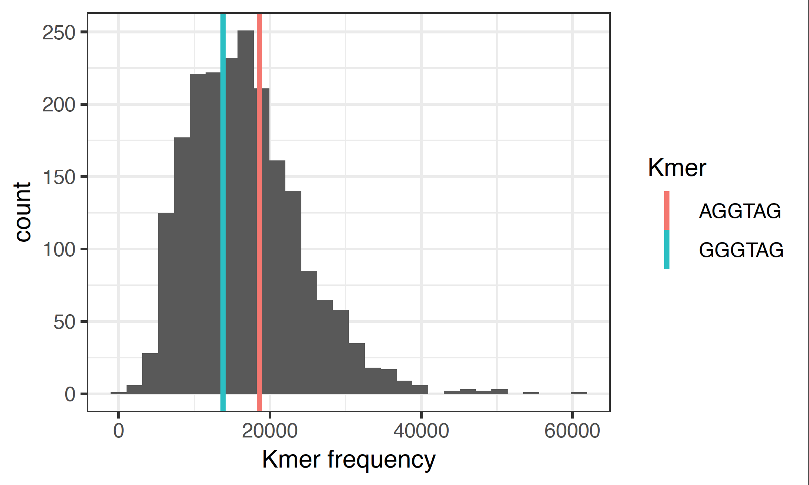

# PoJellyfish: Producing the distribution of kmers of a given size in *Podospora* genomes

Pipeline to calculate the distribution of k-mers (substring) of length six in the genome(s) of *Podospora* species using [Jellyfish](https://github.com/gmarcais/Jellyfish/tree/master/doc).

The pipeline was tested in Unix environments.

## Building the environment

As usual, I used a conda environment. However, this time I provide a `yaml` file containing the necessary dependencies. It looks like such:

```yaml
name: pojellyfish
channels:
  - bioconda
  - defaults
  - conda-forge
  - r
dependencies:
  - snakemake-minimal=5.4.4
  - jellyfish=2.2.10
  - biopython=1.72
  - r-cowplot=1.0.0 # it comes with ggplot2 3.1.1
  - r-tidyr=1.1.0 # included dplyr 1.0.0
```

To install it do:

    $ conda env create -n pojellyfish -f pojellyfish_env.yaml

Equivalently, you can do it manually:

    $ conda create -n pojellyfish -c bioconda

**IMPORTANT!!** activate the environment before installing stuff! 
    
    $ conda activate pojellyfish
    $ conda install -c bioconda snakemake-minimal=5.4.4
    $ conda install -c bioconda jellyfish=2.2.10
    $ conda install -c bioconda biopython=1.72
    $ conda install r-cowplot=1.0.0 # it comes with ggplot2 3.1.1
    $ conda install r-tidyr=1.1.0 # included dplyr 1.0.0 

## Configuration file

The pipeline depends on a configuration file with the path to the assemblies, the name of the strains and the kmers, and the path to the plotting script (provided here in the repo). It should look like so:

```yaml
# Samples
SampleIDs: ["Podan2"]

path2assemblies: "path/to/assemblies" # Assume files are called {sample}*.fa*

kmers: ["AGGTAG", "GGGTAG"]

## Scripts
KmerDist: "scripts/KmerDist.R"
```

## Run pipeline in Johannesson's server

First, to get an idea of how the pipeline looks like we can make a rulegraph. In MacOS you might need to install this first:
 
    $ conda install -c pkgs/main graphviz=2.40.1

To get the rulegraph you do:

    $ snakemake --snakefile PoJellyfish.smk --configfile PoJellyfish_config.yaml --rulegraph | dot -Tpng > rulegraph.png



You can test it (this confirms the the graph is working fine, but it doesn't guarantee that it will run without issues):

    $ conda activate pojellyfish
    $ snakemake --snakefile PoJellyfish.smk --configfile PoJellyfish_config.yaml -pn


If all it's good, finally run the pipeline:

    $ screen -R jelly
    $ conda activate pojellyfish
    $ snakemake --snakefile PoJellyfish.smk --configfile PoJellyfish_config.yaml -p -j 24 --keep-going --use-conda &> PoJellyfish.log &

## Results

The pipeline produces a plot per strain per kmers of a given size: a distribution of all kmers of length X, where X is the length of the kmers given in the configuration file. If kmers of different length are given, then there will be a distribution for each. If there are, say, two kmers of the same length, they will be marked in the final distribution plot together. In the paper we only showed that on Podan2 because it's very similar between strains:


